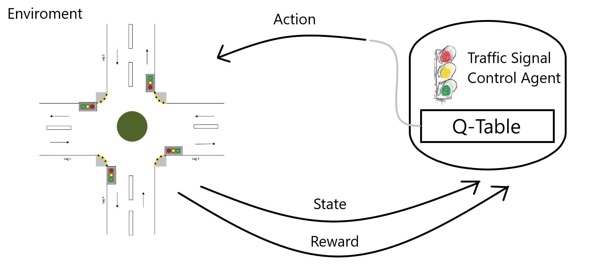
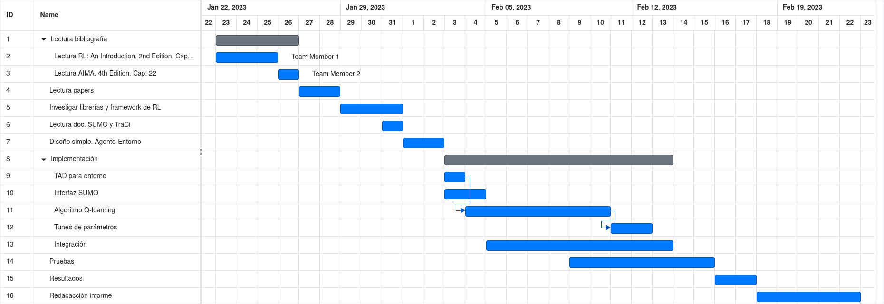

# Controlador dinámico de semáforos usando reinforcement learning
### Código del projecto: TSCRL
### Integrantes: Juan Martín Morales
 

## Introducción

Los semáforos son el principal árbitro para gestionar tráfico en intersecciones, y actualmente la gran mayoría tienen una programación con ciclos fijos que han sido determinados gracias a información histórica o mediante alguna estrategia particular. Además estos no tienen en consideración el tráfico en tiempo real y debido a esto la eficiencia del tráfico es baja. Una mala gestión del tráfico puede causar numerosos problemas, tales como retrasos en los conductores, un gran desperdicio de energía, mayores emisiones de carbono y de óxidos nitrosos, los cuales empeoran la calidad del aire, y también accidentes de tráfico.  

## Propuesta de solución

La idea principal para reducir las problemáticas descritaas, es controlar las luces de los semáforos, seleccionando dinámicamente la mejor acción posible frente al tráfico actual. Para esto propongo utilizar una metodología de reinforcement learning, dónde el agente será el controlador de semáforos y el entorno estará modelado como un proceso de decisión de Markov, el cuál está representado por $< S,A,P,R >$, dónde $S$ es el espacio de estados, $A$ es el espacio de acciones, $P$ es la función de probabilidad de transición de estados y $R$ es la función de recompensas.  

El algoritmo a utilizar será Q learning, y de forma tentativa, también se intentará resolver mediante Deep Q Network.

La eficiencia de la metodología utilizada se hará utilizando la siguiente métrica,
$$AVG\_{Wt}={\frac{1}{n}}{\sum_{i=1}^{n} w_{i,t}}$$

dónde $w_{i,t}$ es el tiempo de espera del vehículo $i$ en el instante $t$.

El modelo será evaluado via simulación, en Simulation of Urban MObility (SUMO), un microsimulador de tráfico. Este provee una API en Python que nos permite acceder a la información completa del tráfico simulado, y manipular el comportamiento de este de forma "on-line".

### Características del agente modelo

+ Agente: el controlador de semáforos de la intersección.

+ Estados: información de la **posición**, **velocidad**, **tiempo de espera** de cada vehiculo en la intersección y las **señales** actuales de los semáforos.

+ Acciones: el controlador seleccionará la duración de cada fase.

+ Recompensa: las recompensas que obtendrá el agente serán en base a los tiempos de espera de los vehículos (en principio.)

## Justificación
   
Para gestionar adecuadamente el tráfico en una intersección es necesario construir un modelo que nos permita preveer la evolución del tráfico, al menos a corto plazo, contemplando todas las variables significantes. Una solución que considero apropiada es la de ajustar dinámicamente las señales de los semáforos en base al tráfico actual. Gracias a algoritmos de reinforcement learning, tales como Q-learning y Deep Q-Network, podemos aprender satisfacer adecuadamente lo planteado.

## Listado de actividades a realizar

1. Lectura bibliografía.  [4 días]

    1. Lectura Reinforcement Learning: An Introduction. 2nd Edition.
        1. Capítulo 3.
        2. Capítulo 4.  
        3. Capítulo 6.
    2. Lectura AIMA. 4th Edition.
        1. Capítulo 22.

2. Lectura papers. [2 días]
    1. Deep Reinforcement Learning for Traffic Light Control in Vehicular Networks. IEEE Transactions on Vehicular Technology.
    2. Using AI and Machine Learning Techniques for
Traffic Signal Control Management- Review. IJERT Journal.  
    3. Reinforcement Learning for Traffic Signal Control: Comparison with Commercial Systems. Transportation Research Procedia.  

3. Investigar librerías y framework de aprendizaje automático. [3 días]
    1. TensorFlow.
        1. Tensorforce.
    2. scikit-learn

4. Lectura Documentación SUMO y TraCi (Python). [1 día]

5. Diseño simple de solución. [2 días]
    1. Diseño agente-entorno. 

6. Implementación en python. [11 días]
    1. Estructuras de datos para representar entorno.
    2. Interfaz entre SUMO y código.
    3. Algoritmo Q-learning.
    4. Tuneo de parámetros.
    5. Integración.

7. Pruebas. [7 días. Paralelo a la implementación]
    1. Pruebas sobre intersección simple.

8. Resultados. [2 días]
    1. Ejecución de simulaciones sobre el entorno.
    2. Recopilación de información (métrica).
    3. Gráficos.

8. Redacción de informe. [5 días]
        
Actividades tentativas.

+ Investigar redes neuronales profundas. [4 días]
+ Investigar algoritmo Deep Q Network (DQN) [3 días]
+ Implementar solución con DQN. [5 días]
+ Extender problema a una calle con $n$ intersecciones. Agente centralizado. [3 dias]

### **Diagrama de Gantt**

## Referencias
[Liang, X., Du, X., Wang, G., &amp; Han, Z. (2019). A deep reinforcement learning network for Traffic Light Cycle Control. IEEE Transactions on Vehicular Technology, 68(2), 1243-1253. doi:10.1109/tvt.2018.2890726](https://arxiv.org/abs/1803.11115)   

[Raeis, M., &amp; Leon-Garcia, A. (2021). A deep reinforcement learning approach for Fair Traffic Signal Control. 2021 IEEE International Intelligent Transportation Systems Conference (ITSC). https://doi.org/10.1109/itsc48978.2021.9564847 ](https://www.researchgate.net/publication/353375159_A_Deep_Reinforcement_Learning_Approach_for_Fair_Traffic_Signal_Control)

[IEEE ITSC‘20 Tutorial - Deep Reinforcement Learning for Traffic Signal Control (slides)](https://docs.google.com/presentation/d/12cqabQ_V5Q9Y2DpQOdpsHyrR6MIxy1CJlPmUE3Ojr8o/edit#slide=id.p)

[SUMO Developer Documentation](https://sumo.dlr.de/docs/Developer/index.html)

De las siguientes slides:
