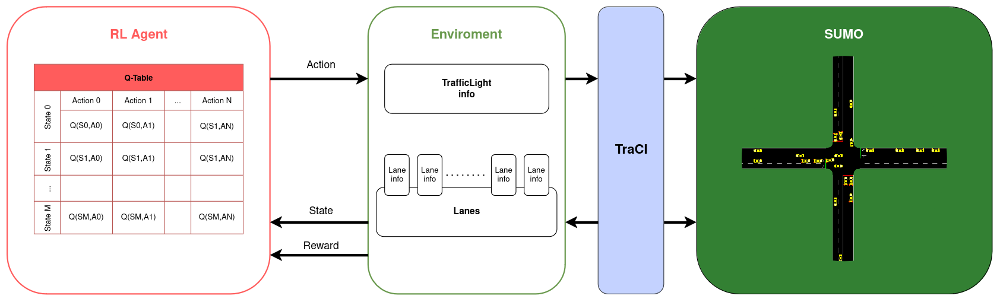
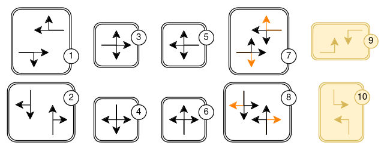

# TSC RL - Solución propuesta 
## Problema

La gestión ineficiente de los semáforos en una intersección causa problemas, como pueden ser tiempos de espera prolongados, que luego se propagan sobre la red de calles conectadas a la intersección. 

## Solución propuesta

Gestionar los semáforos de forma dinámica, teniendo en cuenta el estado de tráfico de la correspondiente intersección, puede conllevar a una mejora notable en los tiempos de espera de los vehículos. 

Para lograr este comportamiento, se propone plantear el problema en el marco del Reinforcement Learning, el cual consiste de dos elemento, el agente y el entorno.

El estudio se realizará sobre una intersección de 2 calles de 4 carriles, y para representar un entorno realista se utilizará [SUMO](https://eclipse.dev/sumo/). SUMO es un paquete de simulación de tráfico multimodal, microscópico y continuo y de de código abierto. Este ofrece la API TraCI, con la cual se obtendrá y enviará información entre el código y la simulación.

### Diseño del flujo de tráfico

#### Vehículos
En la simulación de tráfico habrán 3 tipos de vehículos:

- Vehículo rápido. Velocidad máxima = 22.22 m/s. Proporción = 0.15.

- Vehículo moderado. Velocidad máxima = 11.2 m/s. Proporción = 0.6.

- Vehículo lento. Velocidad máxima = 14 m/s. Proporción = 0.25.

#### Origen - Destino de un vehículo
En entrada a la intersección, un vehículo puede:

- Girar a la izquierda. Con una probabilidad de 0.08.
- Seguir recto. Con una probabilidad de 0.7.
- Girar a la derecha. Con una probabilidad de 0.22.

#### Flujos de tráfico

Los vehículos se incorporarán desde cuatro puntos cardinales: oeste, este, norte y sur. Para identificar los flujos de tráfico, utilizaremos la nomenclatura \[origen\]\[destino\]\[id_tiempo\], donde el id_tiempo representa el orden del intervalo de tiempo en el que el flujo está activo. Algunos ejemplos podrían ser: *we* (oeste-este), *nw3* (norte-oeste, tercer intervalo de tiempo).

Se simularán al menos tres escenarios diferentes de tráfico. Como ocurre en la realidad, hay calles y avenidas donde circulan más vehículos que en las perpendiculares. En los primeros dos escenarios, el tráfico procedente del oeste y del este tendrá un impacto mayor.

1. Flujo de tráfico constante: Durante toda la simulación, los flujos de vehículos serán constantes de principio a fin.

2. Escenario con cambios en el flujo de tráfico cada 4 horas: Este escenario representa mejor la dinámica real del tráfico vehicular, con picos de tráfico alto y bajo.

3. Intercambio de flujos entre calles: Se considerará un caso donde, en diferentes momentos de la simulación, el flujo de vehículos generado por los extremos de una calle se intercambie con los valores de la otra calle en la intersección.

### MDP

El entorno se modelará mediante un Markov Decision Process (MDP). La cuadrupla <$`\mathcal{S}`$,$`\mathcal{A}`$,$`\mathcal{P}`$,$`\mathcal{R}`$>, dónde S denota el espacio de estados, A es el espacio de acciones, P es la matriz de probabilidad de transición de estado, y R es la función de recompensa.

#### Estados

Un estado $`s \in \mathcal{S}`$ se compone de 3 componentes:

- Fase actual del semáforo (8 o 10 valores). 
- Cantidad de vehículos detenidos **por cada calle** o **carril** (3 a 10 valores/intervalos). En el caso de la intersección utilizada, serían 4.
- Tiempo de espera promedio **por cada calle** o **carril**. (3 a 10 valores/intervalos). En el caso de la intersección utilizada, serían 4.

Tanto la cantidad de vehículos detenidos, como el tiempo de espera promedio requieren procesarse por alguna función de discretización. La cantidad de intervalos se evaluará en la experimentación, en principio se realizarán pruebas categorizando en los intervalos marcados (3-10 intervalos).

#### Acciones
El agente controlador de semáforos necesita seleccionar una acción apropiada al estado de tráfico actual de la intersección. Una acción $`a \in \mathcal{A}`$ puede tomar los siguientes valores:

1) $`rrrrGGGrrrrrGGGr`$
2) $`GGGrrrrrGGGrrrrr`$
3) $`rrrrrrrrrrrrGGGG`$
4) $`GGGGrrrrrrrrrrrr`$
5) $`rrrrGGGGrrrrrrrr`$
6) $`rrrrrrrrGGGGrrrr`$
7) $`rrrrGGGgrrrrGGGg`$
8) $`GGGgrrrrGGGgrrrr`$

Cuando se elije la próxima acción, el paso previo al cambio es: transicionar a la correspondiente **fase amarilla**. Siguiendo la enumeración anterior de cada fase posible, estas son las correspondientes fases amarillas:

1) $`rrrryyyrrrrryyyr`$
2) $`yyyrrrrryyyrrrrr`$
3) $`rrrrrrrrrrrryyyy`$
4) $`yyyyrrrrrrrrrrrr`$
5) $`rrrryyyyrrrrrrrr`$
6) $`rrrrrrrryyyyrrrr`$
7) $`rrrryyyyrrrryyyy`$
8) $`yyyyrrrryyyyrrrr`$

Cada caracter/letra de una estado (también acción) de una fase describe el estado de una señal del semáforo. Tenga en cuenta que un mismo carril puede contener varias señales, por ejemplo, una para los vehículos que giran a la izquierda y otra para los que siguen recto. Esto significa que una señal no controla carriles, sino **enlaces**, cada uno de los cuales conecta un carril que entra en un cruce con otro que sale de él.

Son 16 señales de enlace (representado por el caracter) y el orden de cada señal del enlace va en sentido horario. Comienza desde el enlace 0: ***carril entrante norte derecho ⟶ carril saliente oeste derecho*** y termina en el enlace 15: ***carril entrante oeste izquierdo ⟶ carril saliente norte izquierdo***.

A continuación, una descripción de cada señal posible:

| Caracter | Descripción |
|-----------|-------------|
| r         | 'luz roja' para una señal - los vehículos deben detenerse. |
| y         | 'luz amarilla' para una señal - los vehículos comenzarán a desacelerar si están lejos de la intersección, de lo contrario, pasan. |
| g         | 'luz verde' para una señal, sin prioridad - los vehículos pueden pasar la intersección si ningún vehículo utiliza un flujo enemigo con mayor prioridad, de lo contrario, desaceleran para dejarlo pasar. Siempre desaceleran al acercarse hasta que estén dentro de la distancia de visibilidad configurada. |
| G         | 'luz verde' para una señal, con prioridad - los vehículos pueden pasar la intersección. |

#### Función de Recompensa
Sea $`t`$ el instante de tiempo actual, $`L`$ la cantidad de carriles (o calles), $`N_l`$ la cantidad de vehículos detenidos en el carril $`l`$, y $`w_{l_i}`$ el tiempo de espera del vehículo $i$ en el carril $`l`$. $`W_t`$ es el tiempo total de espera en el instante $`t`$, definido como:

$$W_t = \sum_{l=1}^{L} \sum_{i=1}^{N_l} w_{l_i}$$

Entonces, el tiempo de espera acumulado en el instante $`t`$ respecto al instante $`t-1`$ se calcula como:

$$R_t = W_{t} - W_{t-1}$$

### Agente Q-Learning

El proceso de Reinforcement Learning implica que el agente interactue con el entorno, tomando acciones y recibiendo recompensas como resultado de esas acciones. El objetivo principal del agente es aprender una política óptima que le permita maximizar la cantidad total de recompensas acumuladas promedio a lo largo del tiempo. En marco de trabajo del RL, se utiliza la función de valor de acción $Q(s, a)$ para evaluar la calidad de tomar una acción específica $a$ en un estado dado $s$. Esta función representa la recompensa acumulada esperada a partir de tomar esa acción y seguir una política dada $\pi$.

La forma básica de la función de valor de acción se define mediante la ecuación:

$$Q^{\pi}(s,a) = E \left[ r_{t} + \gamma r_{t+1} + \gamma^2 r_{t+2} + \ldots \mid s_t = s, a_t = a, \pi \right]$$

Esto representa la expectativa de la suma de las recompensas futuras ponderadas por el factor de descuento $`\gamma`$. El factor de descuento ($`0 \leq \gamma < 1`$) indica cuánto se priorizan las recompensas futuras en comparación con las inmediatas. En general, se presta atención tanto a las recompensas inmediatas como a las futuras, aunque se les da menos peso a estas últimas.

Si el agente posee conocimiento sobre los valores de $`Q`$ para los estados futuros, puede elegir acciones de manera óptima. La política óptima $`\pi^*`$ seleccionará la acción que maximice la recompensa acumulada esperada. En otras palabras, en un estado dado $`s`$, el agente elegirá la acción $`a`$ que tenga el valor $`Q`$ más alto. Este valor óptimo de $`Q`$ se puede calcular recursivamente basándose en los valores óptimos de los estados futuros. Esto se conoce como la ecuación de Bellman para $`Q`$:

$$Q^* (s,a) = E \left[ r_{t+1} + \gamma \max_{a'} Q^*(s_{t+1},a') \mid s_t = s, a_t = a \right]$$

Una forma común de estimar los valores óptimos de $Q$ es mediante el uso de programación dinámica, que implica actualizar una tabla en cada paso de tiempo. La actualización se realiza utilizando la siguiente iteración:

$$Q^{new}(s_t,a_t) = Q(s_t,a_t) + \alpha \left[ R_{t+1} + \gamma \max_a Q(s_{t+1},a) - Q(s_t,a_t) \right]$$

Donde $`\alpha`$ es la tasa de aprendizaje, un parámetro que controla la rapidez con la que los valores de $`Q`$ convergen hacia los óptimos. Este proceso se repite hasta que los valores de $`Q`$ converjan o hasta que se alcance un cierto número de iteraciones.

### Q-Table

La Q-table utilizada por el agente tendrá las siguientes dimensiones: 

$$(4^{h\_int}\cdot4^{w\_int}\cdot|\mathcal{A}|)\cdot|\mathcal{A}|$$

dónde $`h\_int`$ y $`w\_int`$ son la cantidad de intervalos usados para discretizar *cantidad de vehiculos detenidos por carill* y *tiempos de espera promedio por carril*, respectivamente. $`|\mathcal{A}|`$ es la cantidad de fases posibles.

Para localizar una fila (estado) en la tabla, es necesario aplicar una función de *hash* sobre los componentes que representan al estado observado.

### Codificación (discretización) de estados
Si en cada carril hay una gran cantidad de vehículos el tamaño de la Q-table puede escalar mucho. Por eso, se utilizará un parámetro $I$ (Intervals), para gestionar el tamaño de la tabla. Sea $M$ la máxima cantidad de vehículos por carril, se cumple $I \leq M$.

Se propondrán 2 funciones para discretizar:

1.  Una función con intervalos regulares.
   
$$ 
    f(x, M, I) = \left \lfloor  \frac{(I-1)} {M} x \right \rfloor 
$$  

2.  Una función con comportamiento logarítmico mientras más se aleje $I$ de $M$. Caso contrario, el comportamiento se aproximará al lineal. Si la función anterior no codifica de forma adecuada para el aprendizaje, esta puede ser una buena alternativa. 

    Justificación:  Cuando tenenemos 0, 1, 2, 3 o 4 vehículos puede tener sentido diferenciar estos valores, pero cuando hay 22, 23 o 24 vehículos, no existe gran diferencia en el contexto del estado de tráfico.
    
    Sea $L=\frac{I-1}{M}$,
    
$$
f(x, M, I) = \left\lfloor (1-L)  \frac{I}{\log_2 \left( \frac{M}{M L} + 1 \right)} \log_2 \left( \frac{x}{M L} + 1 \right)+ L^2 x \right\rfloor
$$

### Estrategia Exploración/Explotación

La estrategia $`\epsilon`$ Greedy es un método simple para balanceear la exploración y la explotación. El valor epsilon determina la probabilidad de optar por la exploración frente a la explotación de posibles soluciones.

AL principio el valor $`\epsilon`$ es alto, significando que el agentes estará en un modo de explocaración. A medida que se explora el entorno, el valor $`\epsilon`$ se reduce, y el agente comienza a explotar el apredizaje previo del entorno.

### Parámetros a ajustar
- $`Δt`$. Segundos en un paso de tiempo.
- $`\gamma`$. Factor de descuento.
- $`\alpha`$. Taza de aprendizaje. 
- $`N`$. Cantidad de pasos de tiempo por episodio. En principio constará de $`86400/Δt`$ pasos, dónde $`Δt`$ es un parámetro que determina la cantidad de segundos simulados que transcurren entre cada paso. Un episodio transcurre en 24 horas de **tiempo simulado**.

### Métricas
Para evaluar el desempeño y aprendizaje del Q-Agent se utilarán las siguientes métricas:

- Recompensa acumulada.
 
$$
G_{step} = \sum_{t=0}^{step} R_{t+1}
$$

- Tiempo de espera promedio

